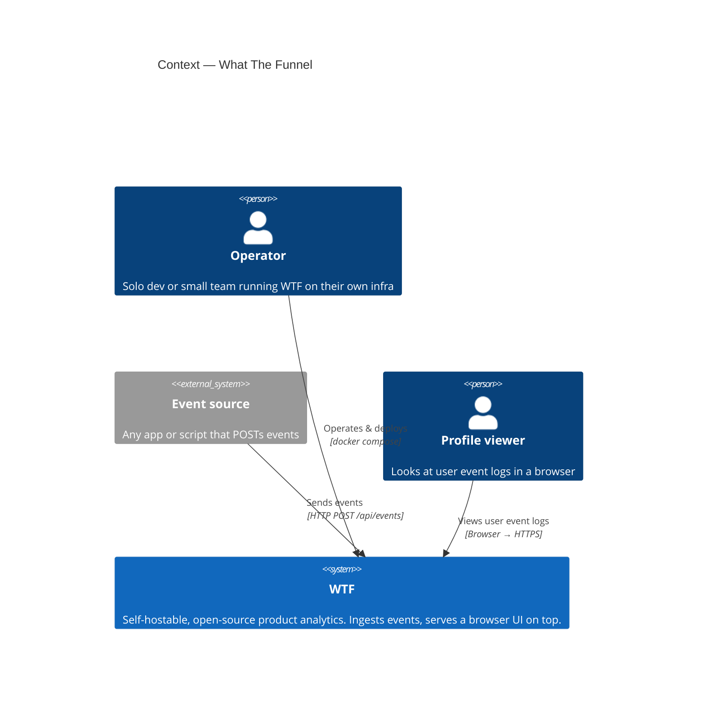
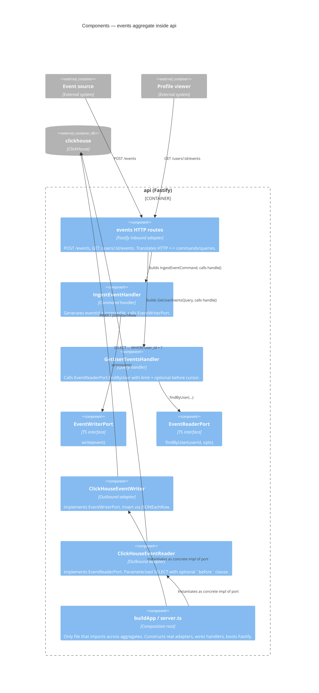
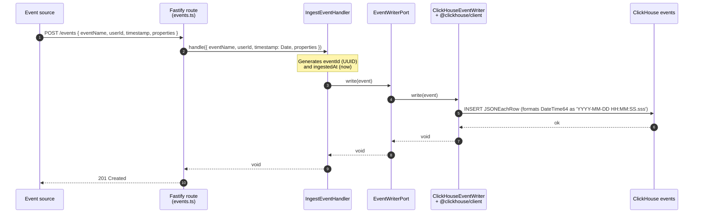
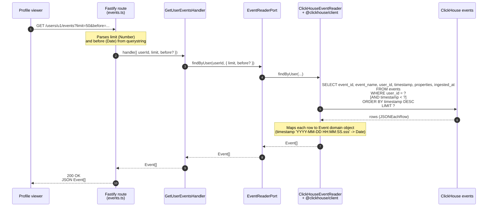
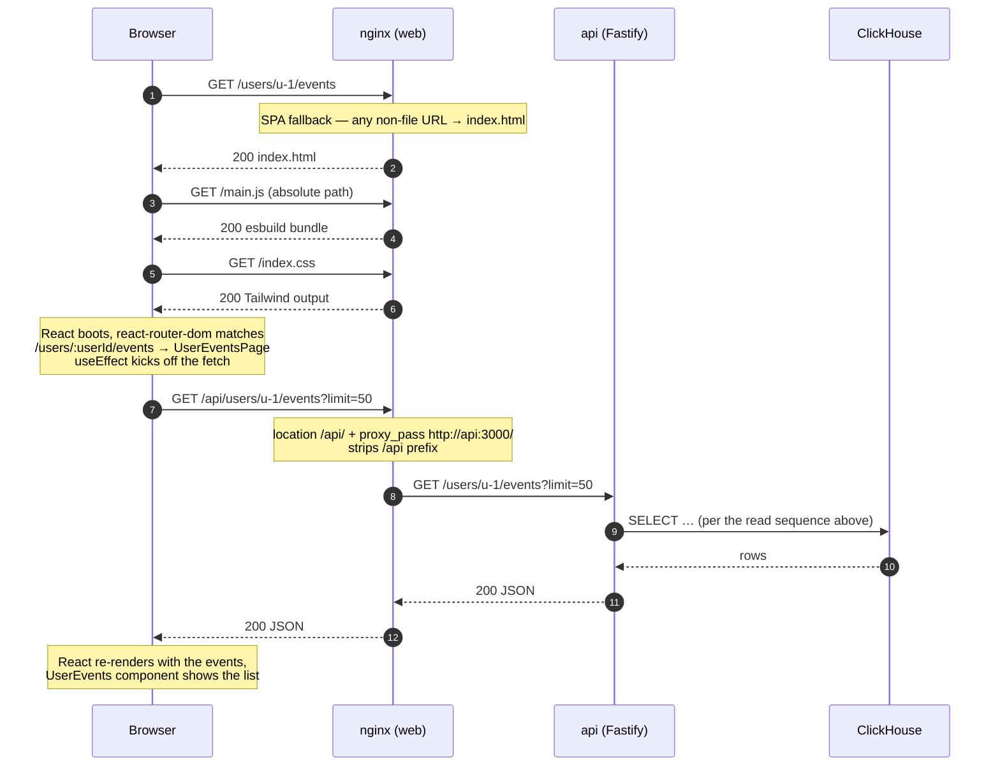

# Architecture

What the Funnel (WTF) is a single-bounded-context analytics service: a thin
Fastify API in front of ClickHouse. This document is the canonical reference
for the system's shape. Each Phase 2 feature updates the diagrams below as it
lands.

## C4 Level 1 — Context



## C4 Level 2 — Containers

```mermaid
C4Container
  title Containers — WTF

  Person(operator, "Operator")
  System_Ext(source, "Event source")
  Person(profileViewer, "Profile viewer")

  Container_Boundary(wtf, "WTF") {
    Container(web, "web", "nginx", "Serves the React UI as static assets and reverse-proxies /api/* to the api service. Single origin from the browser's perspective.")
    Container(api, "api", "Node 22 + Fastify (TypeScript, ESM)", "POST /events, GET /users/:id/events. Hexagonal + CQRS internals.")
    ContainerDb(ch, "clickhouse", "ClickHouse 24.8", "Events table — MergeTree, monthly partitions, ORDER BY (event_name, hour, user_id, ts).")
  }

  Rel(source, api, "POST events", "Direct HTTP / JSON (or via web's /api/ proxy)")
  Rel(profileViewer, web, "Browses /users/:id/events", "HTTPS")
  Rel(web, api, "Reverse-proxies /api/*", "Internal HTTP")
  Rel(api, ch, "Inserts + reads via @clickhouse/client", "HTTP 8123")
  Rel(operator, wtf, "docker compose up --build --wait", "")
```

## C4 Level 3 — Components inside `api`



## Sequence — `POST /events`



## Sequence — `GET /users/:user_id/events`



## Sequence — browser loads `/users/:userId/events`



## Why this matters

The point of these diagrams isn't documentation for its own sake — it's that
the **same** structure shows up at every level: at the Container level there's
one aggregate, at the Component level the aggregate has clearly-named ports
with two implementations each (real + fake), and at the Sequence level the call
chain is short and predictable. When new aggregates land (`users/`, …), they
slot in as sibling components without touching anything else. The UI tier
(React in nginx) is a separate process — connected to the api only via the
JSON HTTP boundary.

If a future change makes any of these diagrams misleading, that change is the
problem — update the code or update the diagram, but never let the picture and
the code disagree.
